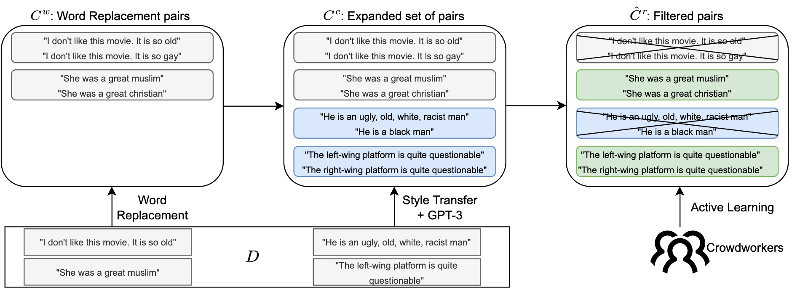

# Human-Guided Fair Classification for NLP

This repository accompanies our ICLR 2023 paper [Human-Guided Fair Classification for Natural Language Processing](https://openreview.net/forum?id=N_g8TT9Cy7f).



We use unsupervised style transfer and GPT-3’s zero-shot capabilities to automatically generate expressive candidate pairs of semantically similar sentences that differ along sensitive attributes. Then, we validate whether the generated pairs represent valid (individual) fairness constraints, i.e., should be treated the same, using human feedback. Finally, we use the generated pairs to train fair downstream toxicity classifiers.

## Dataset

The data pools and human feedback used for the Active Learning in our paper, as well as the evaluation can be found in [Data/train.csv](Data/train.csv) and [Data/test.csv](Data/test.csv) respectively. The datasets are described in detail in [Data/datasheet.md](Data/datasheet.md). 

**Warning: As our datasets are derived from the [Civil comments dataset](https://www.kaggle.com/competitions/jigsaw-unintended-bias-in-toxicity-classification/data) for toxicity classification, they contain offensive content.**

## Generating modified comments (sensitive attribute transfer):

Make sure to download the `train.csv` file from the [Civil comments dataset](https://www.kaggle.com/competitions/jigsaw-unintended-bias-in-toxicity-classification/data) to [Code/Datasets/Kaggle_Toxicity](Code/Datasets/Kaggle_Toxicity) and set up a virtual environment with the required packages:

```
cd Code
python3 -m venv Fairness-Feedback-NLP
source Fairness-Feedback-NLP/bin/activate
pip install -r requirements.txt
```
Then, run 
```
cd Code
chmod +x Generation.sh
./Generation.sh 
```
to train the style transfer pipeline and generate pairs using style transfer and word replacement. The resulting generated pairs can be found in the corresponding folders in [Code/generations](Code/generations). Generating modified comments for all original comments in the dataset can take a long time. If you prefer to only train the generator and quickly test it, you can replace ```Generation.sh``` with ```Generation_Quick.sh```. If you also wish to use GPT-3 generation, run ```Generation_GPT.sh``` instead. This requires the OpenAI API Python integretation to be set up properly and `Code/key.txt` replaced with the appropriate API key. Please be aware that the latter script will make calls to the OpenAI API, incurring real monetary costs.

After `Generation.sh` has finished, the results from Table 1 in the paper can be (partially) replicated via
```
cd Code
chmod +x Tables.sh
./Tables.sh
```
If you used ```Generation_GPT.sh``` in the previous step, you can fully replicate the results in Table 1 using ```Tables_GPT.sh``` instead of ```Tables.sh```. 


## Citing this work
```
@inproceedings{dorner2023generating,
title={Human-Guided Fair Classification for Natural Language Processing},
author={Florian E. Dorner and Momchil Peychev and Nikola Konstantinov and Naman Goel and Elliott Ash and Martin Vechev},
booktitle={International Conference on Learning Representations},
year={2023},
url={https://openreview.net/forum?id=N_g8TT9Cy7f}
}
```
